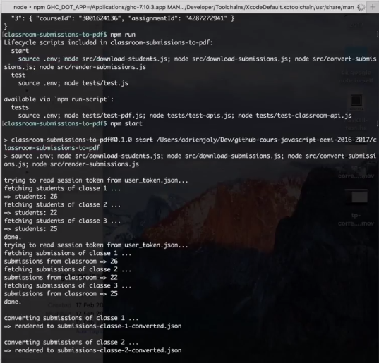
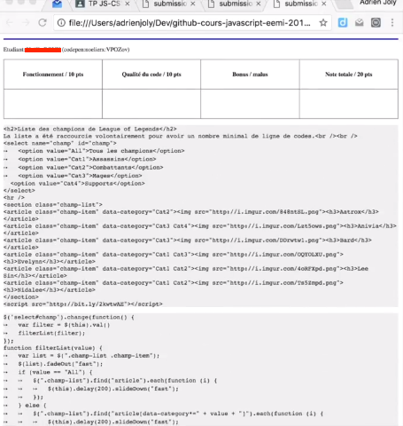
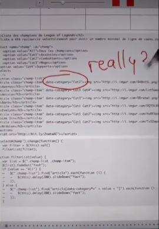
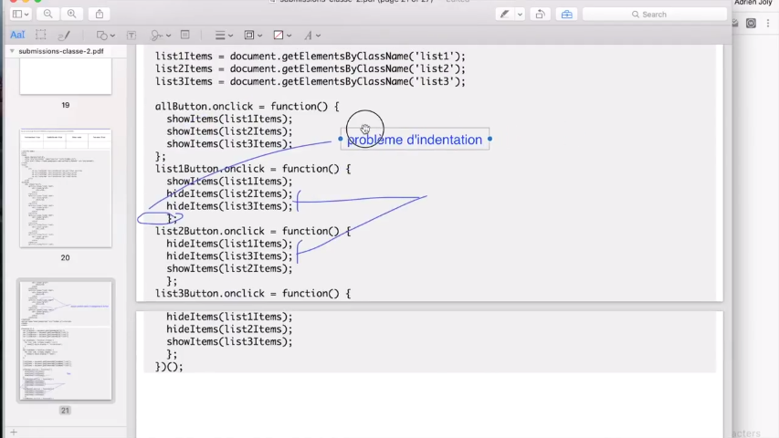

# classroom-submissions-to-pdf

As announced [here](http://mailchi.mp/116ff02883f5/exporter-en-pdf-le-code-de-vos-tudiants-depuis-google-classroom) (in French):

- Fetches student-submitted URLs from Google Classroom
- Downloads HTML+CSS+JS code from Codepen/jsbin/jsfiddle URLs
- Renders one PDF file per student, containing their code, for annotation

🇫🇷 Enseignants francophones, si vous voulez corriger le code de vos étudiants de manière plus efficace, inscrivez-vous à ma liste de diffusion: [adrienjoly.com/eval](https://adrienjoly.com/eval).

## Usage / demo

Watch the short video: [How to evaluate students' code by hand, and without paper - YouTube](https://www.youtube.com/watch?v=L7NQNe72Jec)

### Step 1: Download students' submissions from Google Classroom



### Step 2: Generate HTML and PDF files



### Step 3: Annotate and grade your students' code on iPad



### ... or from any PDF editor



## Prerequisites

- `node`: This requires Node 0.12.x or greater.

## Setup

Before running, don't forget to:

1. create an app and web client auth on Google's Developer Console;   
2. and set the corresponding environment variables: `GCLA_CLIENT_ID`, `GCLA_CLIENT_SECRET` and `GCLA_REDIRECT_URL`
3. run `npm run list` to list the course and courseworks associated to your google account (requires login or valid session)
4. populate the `courseId` and `assignmentId` of your classroom(s) in `groups.json`

All npm scripts that can be used are listed in the `package.json` file.

## Run tests

```sh
$ npm test        # => tests the Google API
```
